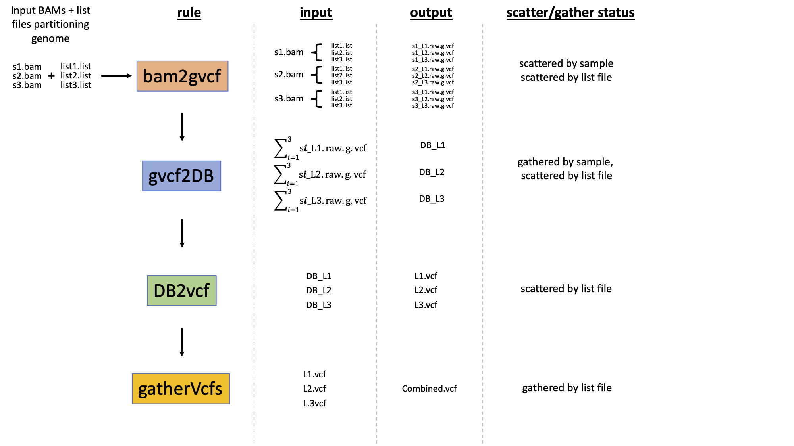

This is a snakemake pipeline to go from fastq's to VCFs.

TO DO:

clean up snakemake files, partitioning rules into separate .smk files. Follow other guidelines that pros do.
Label rules 01\_, 02\_, etc.

call programs not in your home directory

use profile instead of cluster.json file.

add vcf sanity checks with vcftools.

the reference genome must be properly indexed for BWA and GATK beforehand, using bwa's "index", picard's "CreateSequenceDictionary", and samtools "faidx"... but we can probably automate this part.

Also, we should add more preliminary steps that checks and filters fastq files, since errors here may be carried downstream.

We can also add snpEff, but a database must exist, or gff file provided.

make many of these files temporary, but do this later so that entire pipeline doesn't need to be rerun for testing later steps.

