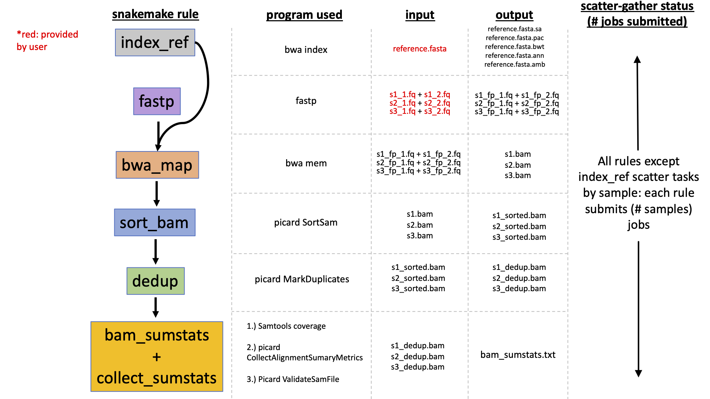
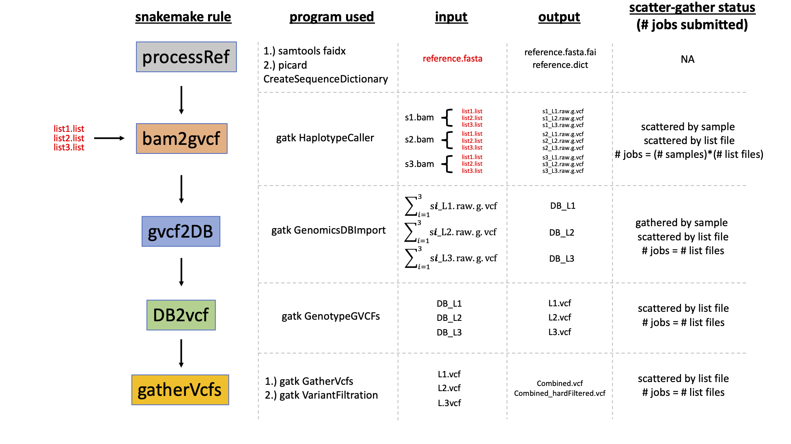

# Automated short-read mapping and variant calling

## Design

This is a suite of snakemake pipelines to call variants with short-read sequence data. These pipelines are split into two modular parts, named by the primary type of input/output files: 

1. **fastq -> BAM**: maps short reads to a reference genome with BWA
2. **BAM -> VCF**: calls variants with GATK4 or Freebayes

Users may start with raw fastq files or with BAM files. If you start with raw fastq files, you must first use the **fastq -> BAM** workflow and inspect the quality of the output BAM files before proceeding (e.g. by checking the summary file we produce). After this workflow completes, you may use the **BAM -> VCF** workflows.

A key feature of the **BAM -> VCF** workflows is a simple algorithm to split the reference genome into many smaller intervals that are processed in parallel on a computing cluster. This speeds up these programs dramatically. These intervals are flanked by strings of N's found in the reference genome in order to avoid edge effects. While lists of intervals already exists for some organisms (e.g. Humans), here we create them ourselves so that these workflows may be used with any non-model organisms.

## How to use

### 0.) Install snakemake, if you haven't already
Please follow the [installation via conda instructions](https://snakemake.readthedocs.io/en/stable/getting_started/installation.html) to install snakemake in a conda environment called "snakemake". The script that ultimately runs the snakemake command is preceded by a line with `conda activate snakemake`, so the exact environment name is necessary unless you change this script. If you already have snakemake installed, you can remove this line with `conda activate snakemake` from all the \*sh files.

### 1.) Download code
First clone this repository and move into the new directory: 
```
git clone https://github.com/harvardinformatics/shortRead_mapping_variantCalling
cd shortRead_mapping_variantCalling
```

### 2.) Set values of important variables
Witin this directory a file named `config.yaml` stores many variables, including the location of files (e.g. reference genome) as well as file suffixes (e.g. forward read data end in "\_1.fastq.gz"). The top section of `config.yaml` contains the variables that *need* to be changed, and comments within this file describe these variables. 

#### 2b.) Parameterize algorithm to split up genome (most complicated bit, may need to simplify)
`config.yaml` also contains two variables to define genomic intervals for parallel processing:

1. `minNmer`: the minimum length of an Nmer used to define the beginning/end of an interval. Generally, smaller values (e.g. 200bp) will create many smaller intervals whereas larger ones (e.g. 2kb) will create fewer larger intervals. However,the number of intervals completely depends on the reference genome assembly and its distribution of Nmers. Values from 500bp to 2kb are a good place to start

2. `maxIntervalLen`: the maximum length of a genomic interval allowed. This value ensures that whatever minNmer value is specified above, intervals never exceed a certain value, as this can significantly slow down the workflow (taking weeks instead of days for GATK). The best value to choose for this may depend on how many samples you have, but values above 15Mb may be a good place to start.

3. `maxBpPerList`: the maximum number of bp (summed length of intervals) allowed in a list file used by GATK4. I usually just set this to the same as `maxIntervalLen` above.

If you specify a minNmer value that does not sufficiently break up the genome -- creating intervals larger than maxIntervalLen -- the workflow will halt and show you the maximum interval length it found for various Nmers in the genome. With these data you can adjust the parameters accordingly.

### 3.) Set the resources to request for various steps
The `resources.yaml` file may be changed to increase the amount of requested memory (in Megabytes) or the number of threads for the steps that support multi-threading. Not all steps in the workflows are included here, so these use the default amount of resources. **NOTE**: if any job fails, it gets resubmitted with increased memory calculated as (*attempt number*)\*(initial memory).

### 4.) Submit workflow(s)!
After updating the config.yaml file, you may now run one of the workflows, which gets submitted as a job that itself submits many jobs (max of 1000, may be changed).

#### fastq -> BAM workflow
To run, simply type the following on the command line to submit this workflow as a job:
```
sbatch run_fastq2bam.sh
```

#### create intervals for parallelizing variant calling
Before running the BAM -> VCF workflows, you must run a fast (depending on genome assembly) algorithm that splits up the genome into many intervals flanked by N's (described above). Because the outcome of this will vary by genome and depend on the parameters in the `config.yaml` file, we suggest you check the output of this short workflow to make sure everything went well. For instance, it's possible that, given the parameters and your assembly, the algorithm found ~100k intervals. Dividing the genome into this many intervals may slow down the workflow, as these short jobs will spend more time pending in the queue than actually running. Type the following on the command line:
```
sbatch run_intervals.sh
```
and go to the `intervalFiles` directory. In the subdirectory `gatkLists` you'll find the list files used to partition the genome. GATK requires intervals be specified in this way, and each list file contains potentially many intervals. The number of list files will be proportional to how many jobs ultimately get submitted, and 10's to 100's of list files is probably OK.

For the Freebayes workflow, the file `intervals_fb.bed` contains the intervals used to partition the genome. Again, something on the order of 1000 to 10k intervals is probably fine (just count the number of lines in this file using `wc -l intervals_fb.bed`).

If you dont get the desired number of intervals, you can change `minNmer` in the config file; increasing the value will result in fewer intervals, decreasing it will create more. You can also look at the `interval_algo.out` file in the `intervalFiles` directory to see what the maximum interval length is for each minNmer. You can use this information to select a minNmer that doesn't create too large of intervals which can slow down the workflow.

NOTE: a perfect assembly with no N's will have as many intervals as there are chromosomes.

#### BAM -> VCF workflows
To run GATK4, type the following on the command line:
```
sbatch run_bam2vcf_gatk.sh
```

To run Freebayes, type the following on the command line:

```
sbatch run_bam2vcf_fb.sh
```

Once the workflow is submitted as a job, it may take a while to build the software environment before it does anything. 

The workflows successfully completed if the final summary files (described in next section) are in the appropriate directory.


## Description of output files
### fastq -> BAM workflow

Successful completion of this workflow will create `bam_sumstats.txt`, with columns that contain the following information:
1. Sample name
2. Fraction of reads that passed fastp filter
3. Number of filtered reads
4. Percent of PCR duplicates
5. Percent of paired-end reads that mapped to the genome with mapping quality greater than 20
6. Percent of aligned bases that have base qualities greater than 20
7. Mean sequencing depth per site
8. Number of bases covered *at least* once
9. Logical test for whether your BAM file is valid and ready for variant calling (according to picard's ValidateSamFile tool). If not, check the appropriate _validate.txt file in the 02_bamSumstats dir. "FALSE" values indicate that variant callers may fail downstream, although not necessarily as this validation step is very fussy.

### BAM -> VCF workflow

Successful completion of this workflow will create a VCF file entitled `Combined_hardFiltered.vcf` as well as some files for quality control. These files include 

1. `SNP_per_interval.txt` showing how many SNPs were detected for each genomic interval. These data may be used to ensure that variants were called for each interval. The columns of this file correspond to
    1. scaffold/chromosome name
    2. start position of interval in reference genome
    3. end position of interval in reference genome
    4. number of SNPs detected
2. `missing_data_per_ind.txt` showing how many genotypes are missing per individual (the output of vcftools --missing-indv). The columns of this file correspond to:
    1. sample name
    2. number of genotypes for this sample
    3. number of genotypes filtered out due to low quality
    4. number of genotypes completely missing (e.g. due to low sequencing depth)
    5. fraction of missing genotypes (column 4 divided by column 2)

## Changing the versions of programs

The versions of the various programs may be found in the YAML files in the `envs/` directory. You may update any programs listed under the 'dependencies' heading, replacing the version number with the latest you can find after searching the [Anaconda cloud](https://anaconda.org/).

### Test Data

There are currently two different test datasets that accompany this workflow. The zebrafinch data consists of reads for 3 individuals that map to a genome with 3 scaffolds (each 200kb in length). The Black head duck data consists of reads for 3 individuals that maps to a genome with a single scaffold that gets split (by Nmers) into subintervals.


# please ignore everything below this :)
# please ignore everything below this :)
# please ignore everything below this :)


## Workflow components
### Part 1: fastq -> BAM



As mentioned above, we encourage users to inspect the BAM files at this point. Please find many informative metrics in "bam_sumstats.txt". This file contains the following information:
1. Sample name
2. Fraction of reads that passed fastp filter
3. Number of filtered reads
4. Percent of PCR duplicates
5. Percent of paired-end reads that mapped to the genome with mapping quality greater than 20
6. Percent of aligned bases that have base qualities greater than 20
7. Mean sequencing depth per site
8. Number of bases covered *at least* once
9. Logical test for whether your BAM file is valid and ready for variant calling (according to picard's ValidateSamFile tool). If not, check the appropriate _validate.txt file in the 02_bamSumstats dir. "FALSE" values indicate that variant callers may fail downstream, although not necessarily as this validation step is very fussy.

### Part 2: BAM -> VCF

Calling variants can be a time-consuming task for eukaryotic data, but running independent tasks in parallel can speed this process up. There are two approaches to [parallelization](https://gatk.broadinstitute.org/hc/en-us/articles/360035532012-Parallelism-Multithreading-Scatter-Gather): multi-threading and scatter-gather. Multi-threading involves instructions written into the program itself to use multiple cores on a machine (or node on Cannon computing cluster), while the scatter-gather approach involves running multiple copies of the program simultaneously on indepdendent tasks. For instance, we could give GATK 10 cores for multi-threading, or we could divide the genome up into 10 parts and run GATK with 1 core on each of these parts, gathering the results into a single file at the end. This workflow uses the scatter-gather approach, as multithreading is not fully supported at all GATK steps at the moment. 

The scatter-gather approach requires dividing the genome up into segments (e.g. entire chromosomes/scaffolds or even subintervals within scaffolds), and storing these segments in separate "list" files that we later give to GATK to tell it to only work on that particular interval. Ideally, each list file would represent similar fractions of the genome so that all tasks take a similar amount of time. These list files have been created by the Broad for the human genome, but we have written an algorithm into this pipeline that will create these intervals for non-model organisms. Briefly, this algorithm works by finding all regions of the genome with consecutive N's (Nmers), as it is [recommended](https://gatk.broadinstitute.org/hc/en-us/articles/360036823571-ScatterIntervalsByNs-Picard-) that subintervals within scaffolds are flanked by Nmers to avoid problems with variant calling at the edges of intervals. The user can specify in the config file the minimum Nmer length to decide whether to split a scaffold into smaller subintervals. A minimum length of 500bp is probably fine, and you can likely go down to 100bp since this is the length of [padding used](https://gatk.broadinstitute.org/hc/en-us/articles/360035889551-When-should-I-restrict-my-analysis-to-specific-intervals-) when calling variants within exomes.

At its peak of resource consumption, the bam -> VCF workflow submits up to (# samples)X(# list files) jobs, although one may control the maximum number of jobs snakemake submits on the command line.



If something in the workflow fails, check the log file and look for the keyword "Error", which should direct you to the specific tasks that failed. It is very possible that some errors may be fixed by simply rerunning the Snakefile, as temporary hardware issues may cause errors, e.g. the computing cluster not responding which can cause Input/Output errors. Occasionally, one step will fail because a previous step  produced truncated output (I have seen fastp produce corrupted files that get fed to bwa, where the error ultimately occurs that snakemake detects). In these cases, these files must be manually removed for snakemake to reproduce them.

Make sure all programs are updated!! GATK actively changing and bugs being fixed all the time!!

To change the resources each task requests, please see the cluster_config.yml file in the subdirectory profiles/slurm/. However, a few rules have their resources specified within the rule specification (in rules subdir) so that the requested memory can be incremented with each attempt. I was not able to get this feature working while specifying memory for that rule within the cluster_config file.

## TO DO:

- simplify variable names? listDir confusing bc it's used for FB which uses intervals not lists
- how to change queue
- optimize interval-creating algo for big genomes
- for variables continaing directory, ask if they end in "/" otherwise add this!

- ive tried the following to address the problem below, re. resubmitting with many resouces. It seems resources need to be specified in the rule, with the resources keyword, and multiplied by the special 'attempt' variable. However, if any resources are specified within cluster_config.yml under the default, these always override resources specified in the rule and it doesn't work. Moreover, if I instead use a value obtained from a dict, it also doesn't work. Basically the only way I'm able to get things to work now is if I specify the number directly in the rules file.
- it really seems like if there are any job submission parameters defined in cluster_config.yml, either for the specific rule or __default__, it just uses those and ignores any job-specific resource allocations.
resubmit failed jobs; for genomicsdbImport, resubmit with more mem too 
make failed jobs resubmit tasks with more resources! e.g. genomicsDBImport
also resubmit haplotypecaller jobs that fail for inexplicable reasons, maybe with 30% more memory?
resources:
        mem_mb=lambda wildcards, attempt: attempt * 100
        # with --restart-times 3, attempt will take on values 1 thru 3

update this, putting all the options found in profile/slurm/config.yaml

post VCF stuff: number of SNPs, number of filtered SNPs, SFS,rrelatedness (vcftools), PCA (the low depth version), NJ tree, SNPs per bp for each scaffold (or any metric that indicates regions of the genome look bad).


have some recommendations about requesting memory/time, maybe even running it on a few individuals first to see what bam2gvcf takes. recommend serial_requeue for bam2gvcf since it doesn't take long? this is also the step that submits the most jobs by far, so keeping resource requests light is important. Also keep in mind that a few (3) Gb gets subtracted from what you request, since jave needs a few extra to run things in the background. CHANGE SCHEMATICS TO HAVE SUGESTED QUEUE, RESOURCE ALLOCATION, suggest low-pending-time queue for bam2vcf. SOme jobs submitted to serial_requeue may fail for strange reasons (e.g. "ModuleNotFoundError"), but resubmitting them by restarting the snakemake pipeline should do the trick.

make bam2vcf workflow more flexible; e.g. it assumes bams names sample_dedup.bam, but users may have bams with diff names; picard scatterByNs requires indexed genome and dequence dict, but this gets done in fastq2bam. To see how to do this best, you could practice on other datasets, starting at the BAM stage.

have option for low seq depth that uses particular tools? E.g. relatedness also depends on depth

have more input checks? e.g., if you specify wrong suffix, an obscure error comes up in the snakemake rules

how to make pipeline have less variability across runs? make script that takes vary large scaffolds and creates subintervals?

practice having the snakemake job fail in several ways, e.g. timeout, and provide notes on how to restart the workflow, e.g. using the --unlock command and having snakemake delete incomplete files?


run on other datasets and have other people try to use it

report median depth of BAMs as well, use gzipped VCFs 

output log files to separate dir.

can snakemake check if a file is corrupted? if so, remove so that pipeline can be rerun without having to manually remove the file? Saw this for fastp... produced corrupted files but still completed successfully (no exit status greateer than 1?) such that bwa failed.

make streamlined system for eliminating particular samples that just aren't behaving. Currently, you have to remove them from the fastq dir.


add vcf sanity checks with vcftools.

Also, we should add more preliminary steps that checks and filters fastq files, since errors here may be carried downstream.

We can also add snpEff, but a database must exist, or gff file provided.

make many of these files temporary, but do this later so that entire pipeline doesn't need to be rerun for testing later steps.
