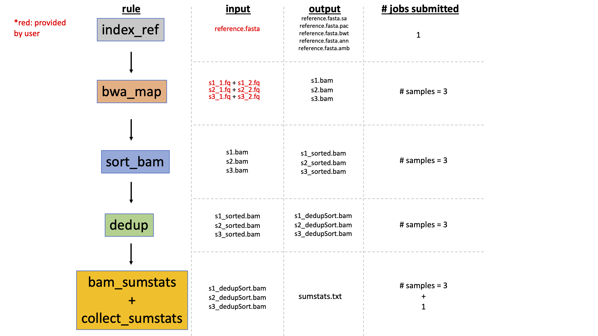
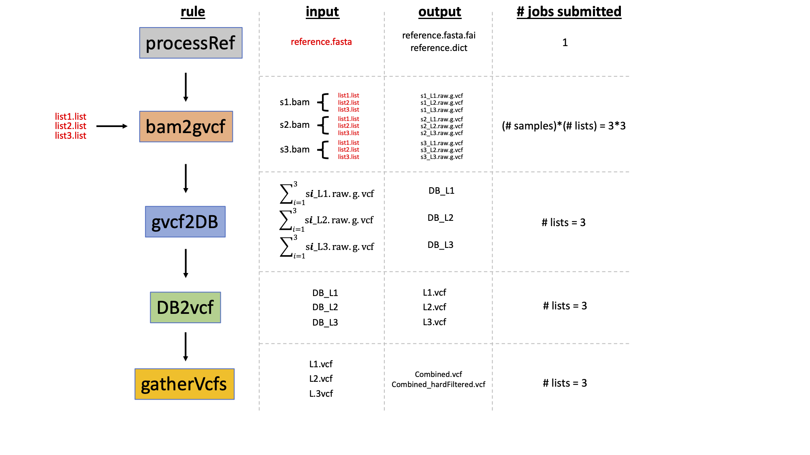

This is a snakemake pipeline to go from fastq's to VCFs.

The genome must first be divided into segments so that GATK may be parallelized across these subregions of the genome, making it run significantly faster. This pipeline may not work efficiently for assemblies with many scaffolds (e.g. ~100k or more) as we have observed certain parts of the GATK workflow perform poorly if given lists containing hundreds or thousands of small scaffolds (I have observed only with Loxodonta africana, so may not be general problem). One alternative would be to limit list sizes, with the caveat that this could create many list files. At its peak of resource consumption, the bam -> VCF workflow submits up to (# samples)X(# list files) jobs, unless the number of concurrently running jobs is limited within snakemake by the user. Many list files may thus result in the submission of very many jobs.

## TO DO:

make a script that takes as input a 2-column file: scaffold name and scaffold size, and have it output a series of list files to divide up the genome. You may have already done this for the elephant project.

post VCF stuff: relatedness (vcftools), missingness (vcftools), PCA, NJ tree

clean up snakemake files, partitioning rules into separate .smk files. Follow other guidelines that pros do.

use profile instead of cluster.json file.

add vcf sanity checks with vcftools.

Also, we should add more preliminary steps that checks and filters fastq files, since errors here may be carried downstream.

We can also add snpEff, but a database must exist, or gff file provided.

make many of these files temporary, but do this later so that entire pipeline doesn't need to be rerun for testing later steps.

## Snakemake pipeline 1: fastq -> BAM

This is an intentional stopping point to ensure that all BAMs look alright according to the numbers in the "sumstats.txt" file. E.g. make sure dequencing depths are around what you expect etc.

## Snakemake pipeline 2: fastq -> BAM

